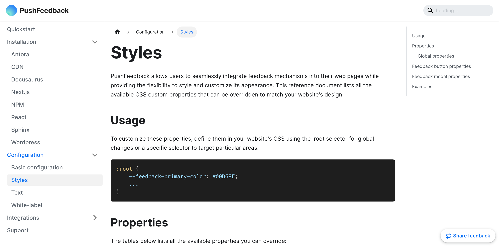

# Feedback widget for Docusaurus

Here's a step-by-step guide to help you install PushFeedback in your Docusaurus project using NPM.

## Prerequisites

Before you begin, you'll need to have the following:

- A PushFeedback account. If you don't have one, [sign up for free](https://app.pushfeedback.com/accounts/signup/).
- A project created in your PushFeedback dashboard. If you haven't created one yet, follow the steps in the [Quickstart](../quickstart.md#2-create-a-project) guide.
- A Docusaurus site and Node.js installed.

## Installation

To integrate the PushFeedback widget into your Docusaurus site:

1. Open your terminal or command prompt. Navigate to your project's root directory using the `cd` command:

    ```console
    cd path/to/your/project
    ```
    
    Replace `path/to/your/project` with your project's actual directory path.

1. With your terminal still open, run the following command to install PushFeedback:

    ```console
    npm install docusaurus-pushfeedback
    ```

1. Add the plugin to your Docusaurus config file `docusaurus.config.js`:

    ```js
    plugins: [
        [
            'docusaurus-pushfeedback',{
                project: '<YOUR_PROJECT_ID>'
            }
        ]
    ],
    ```

    Replace `<YOUR_PROJECT_ID>` with your project's ID from the [PushFeedback dashboard](../quickstart.md#2-create-a-project).

1. Start your Docusaurus project by running `npm start` or `yarn start` in your terminal. Once it compiles successfully, verify that the feedback button appears and functions correctly on your site.

    

## Customization

You can customize the PushFeedback widget to suit your needs. For example, you can change the widget's position, color, and more.

To do so, you can add any of the following [configuration](../configuration/layout.mdx) options to the plugin formatted as camelCase.

Here's an example:

```js
plugins: [
    [
        'docusaurus-pushfeedback',{
            project: '<YOUR_PROJECT_ID>',
            buttonPosition: 'center-right',
            modalPosition: 'sidebar-right',
            buttonStyle: 'dark',
        }
    ]
],
```

To further customize the style of the PushFeedback widget in Docusaurus, such as altering the widget's background color, you can override specific CSS properties. This is done by defining these properties in a custom stylesheet. Here's how you can do it:

1. In your project's `src` directory, create the file `css/custom.css`.

1. In the `custom.css` file, you can define your custom CSS properties. For example, to change the widget's primary color, add the following CSS rule:

    ```css
    :root {
        --feedback-primary-color: #FF0000; /* Replace #FF0000 with the hex color code of your choice */
    }
    ```

    For a complete reference of properties you can modify, see the [Styles](../configuration/styles) documentation.

1. Open your `docusaurus.config.js` file and locate the `presets` array and within it, the `classic` preset configuration. Then, add a reference to your custom stylesheet in the theme configuration. It should look something like this:

    ```js
    presets: [
        [
            'classic',
            {
            // ... other configurations ...
            theme: {
                customCss: require.resolve('./src/css/custom.css'), // Add this line
            },
            // ... other configurations ...
            },
        ],
    ],
    ```

## Advanced setup: Custom placement with Swizzling

This alternative installation method is best for those projects that require granular control over the widget's positioning.

To integrate the PushFeedback widget into your Docusaurus site:

1. Open your terminal or command prompt. Navigate to your project's root directory using the `cd` command:

    ```console
    cd path/to/your/project
    ```
    
    Replace `path/to/your/project` with your project's actual directory path.

1. With your terminal still open, run the following command to install PushFeedback:

    ```console
    npm install pushfeedback-react
    ```

1. For Docusaurus, the best approach is to swizzle the original footer component to embed the PushFeedback button. This ensures the feedback button is loaded just before the closing body tag for optimal performance. Begin by using the npm run swizzle command to start the swizzle process:

    ```console
    npm run swizzle @docusaurus/theme-classic Footer
    ```

    When prompted with the question: `Do you want to --wrap the component instead? (Y/N)`, choose **Y** for "Yes".

    By choosing to wrap, Docusaurus will create a wrapper component for the Footer in the `src/theme` directory. This allows you to extend the original footer component without modifying its intrinsic content.

1. After swizzling, navigate to `src/theme/Footer/index.js` in your project directory. Now, integrate the PushFeedback button:

  ```js
    import React, {useEffect} from 'react';
    import Footer from '@theme-original/Footer';

    import { FeedbackButton } from 'pushfeedback-react';
    import { defineCustomElements } from 'pushfeedback/loader';
    import 'pushfeedback/dist/pushfeedback/pushfeedback.css';

    export default function FooterWrapper(props) {

    useEffect(() => {
        if (typeof window !== 'undefined') {
        defineCustomElements(window);
        }
    }, []);

    return (
        <>
        <FeedbackButton project="<YOUR_PROJECT_ID>" button-position="default" modal-position="center" button-style="light">Feedback</FeedbackButton>
        <Footer {...props} />
        </>
    )
    }  
    ```

    Replace `<YOUR_PROJECT_ID>` with your project's ID from the [PushFeedback dashboard](../quickstart.md#2-create-a-project).

1. Start your Docusaurus project by running `npm start` or `yarn start` in your terminal. Once it compiles successfully, verify that the feedback button appears and functions correctly on your site.

